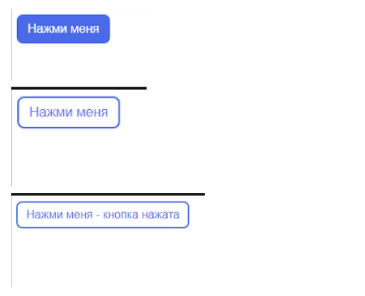

HTML, CSS, JavaScript: домашние задание 4

Задание 1

Создать HTML-страницу, которая содержит 3 блока с заголовком и текстом, заголовок должен “прилипать” к верхней части страницы при прокрутке. Тегу body задать высоту в 2000px. Наполнение блоков произвольное, можно воспользоваться сайтом https://www.lipsum.com/.

Должно получиться:

